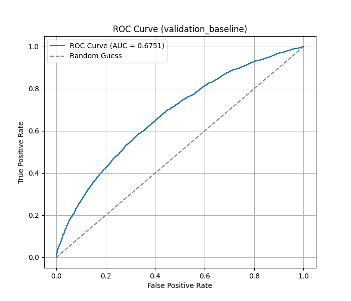
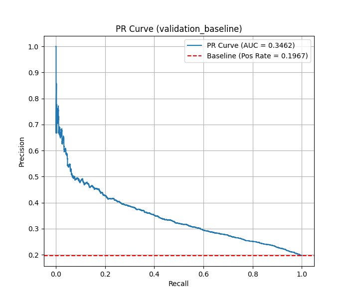
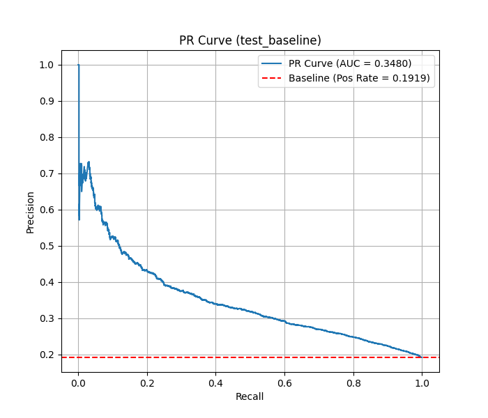
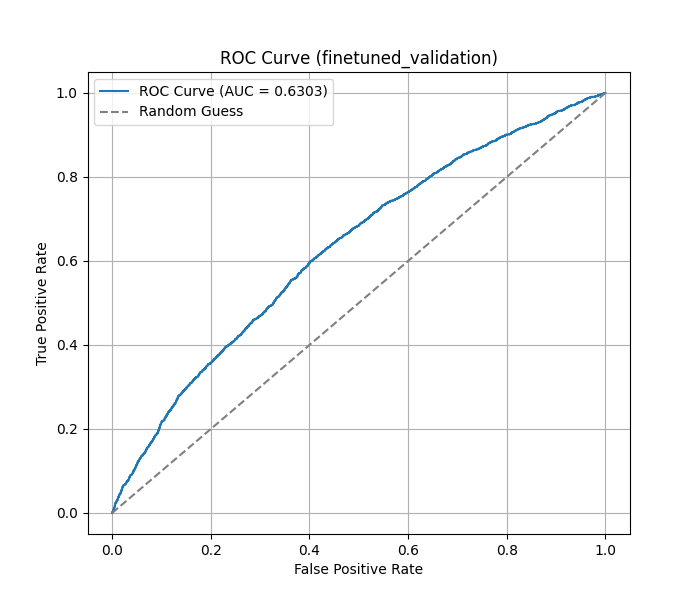
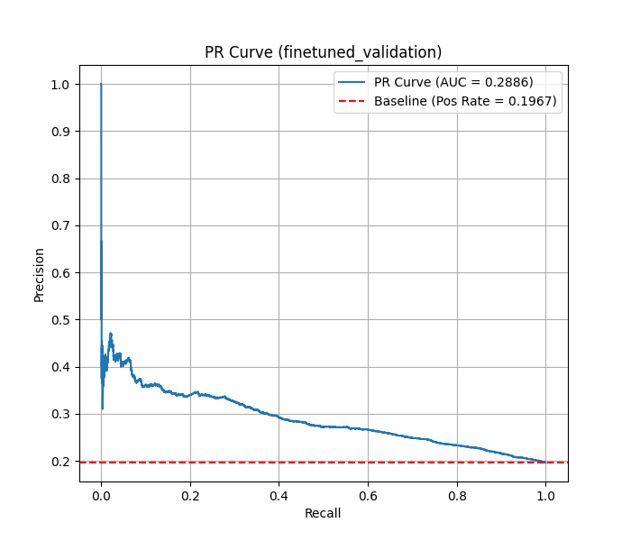
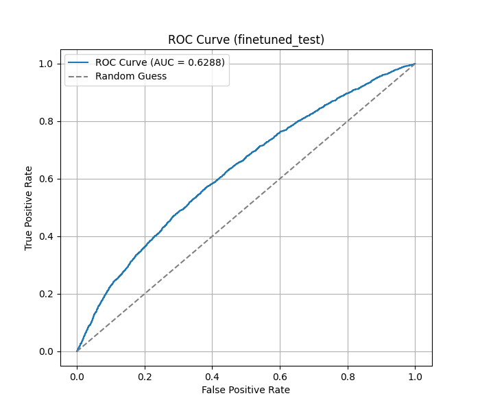
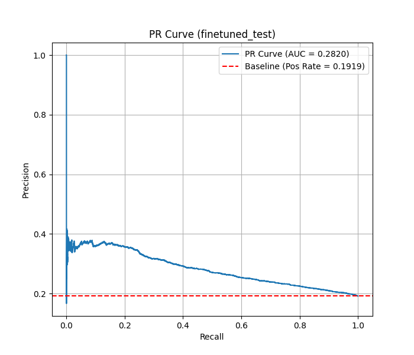

# Results

This section summarizes computational performance and model results for the baseline and lightly fine-tuned BioClinicalBERT pipelines executed on the Nautilus Kubernetes platform.

---

## Computational Performance

All experiments were run as Kubernetes Jobs in the `gp-engine-mizzou-dsa-cloud` namespace. Local work was limited to early data preparation steps prior to text preprocessing.

**Baseline job**
- Runtime: ~80 minutes (07:00–08:20 UTC)
- Resource requests: CPU 1, Memory 12 GiB, GPU 1
- Primary cost: BioClinicalBERT embedding generation
- Status: Completed successfully

**Fine-tuning job**
- Runtime: ~22 minutes (08:53–09:15 UTC)
- Resource requests: CPU 2, Memory 16 GiB, GPU 1
- Training: classification head only
- Status: Completed successfully

---

## Model Performance

Evaluation prioritized recall for the readmitted class. Decision thresholds were selected on the validation set to target approximately 0.75 recall.

**Baseline model (frozen embeddings + logistic regression) — test set**
- Accuracy: 0.54
- Precision: 0.26
- Recall: 0.76
- F1-score: 0.38
- ROC-AUC: 0.68
- PR-AUC: 0.35

**Lightly fine-tuned BioClinicalBERT — test set**
- Accuracy: 0.43
- Precision: 0.22
- Recall: 0.81
- F1-score: 0.35
- ROC-AUC: 0.63
- PR-AUC: 0.28

The fine-tuned model improved recall at the expense of precision and overall discrimination, consistent with the recall-focused objective.

---

## Visualizations

### Baseline Model — Validation

### Baseline Model — Test

### Fine-Tuned Model — Validation

### Fine-Tuned Model — Test

These plots show that both models favor sensitivity to readmissions at the cost of increased false positives, reflecting recall-driven threshold selection in an imbalanced clinical dataset.

---

## Reproducibility

Results are reproducible using the same Docker image, Kubernetes manifests, and dataset. Fixed random states were used for data splitting. Minor variability may occur due to GPU nondeterminism.
